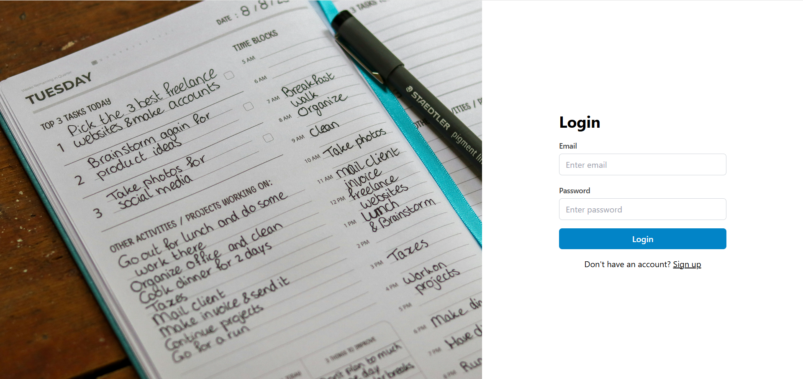
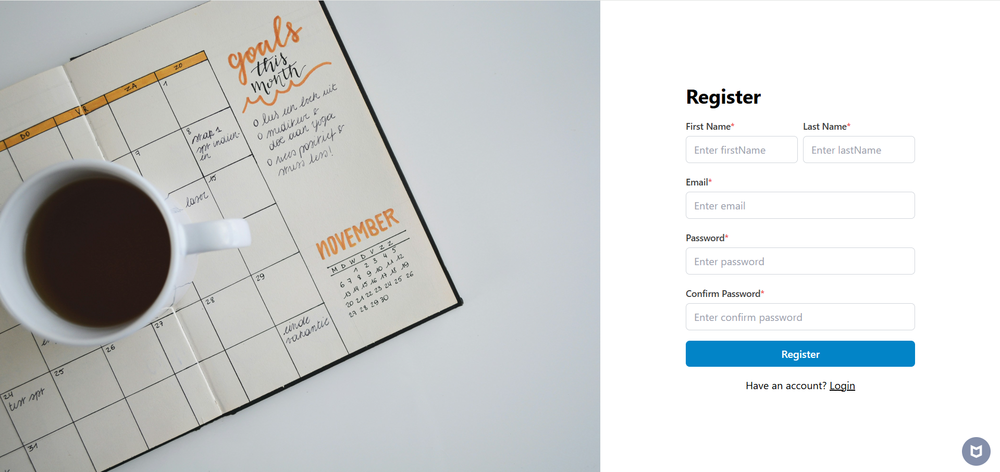
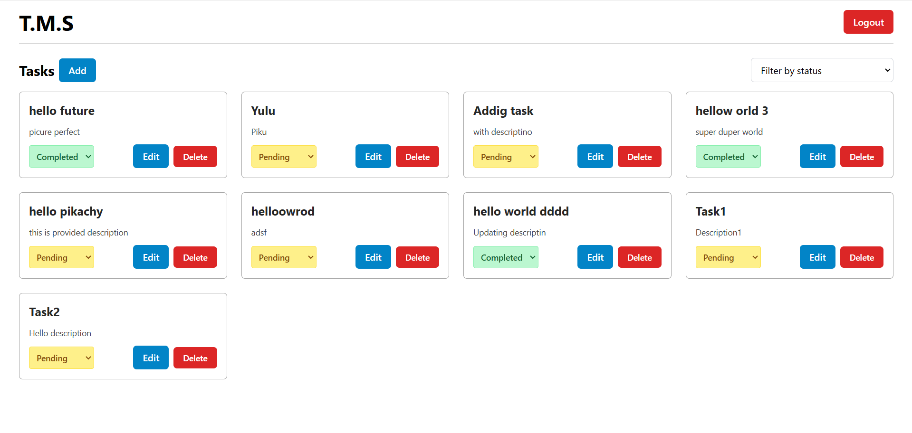
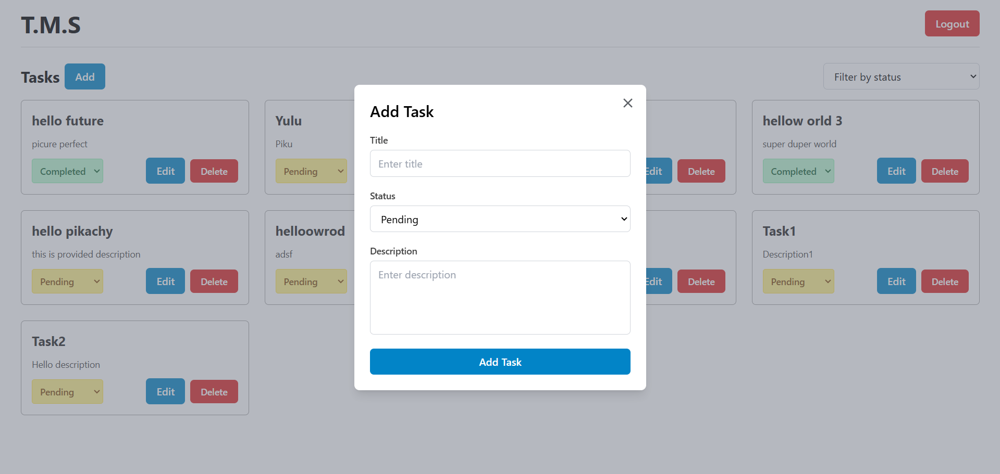
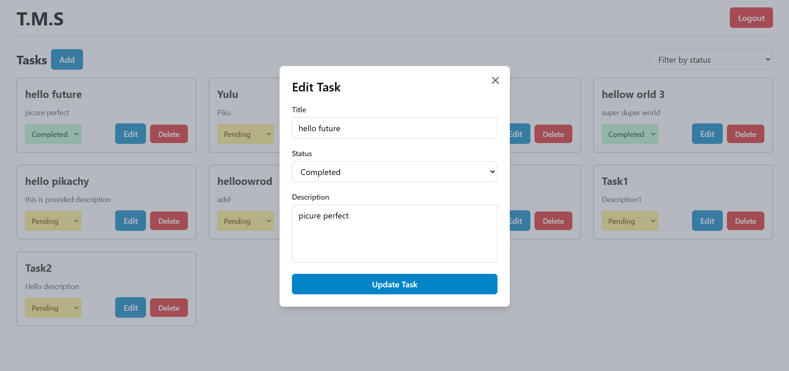
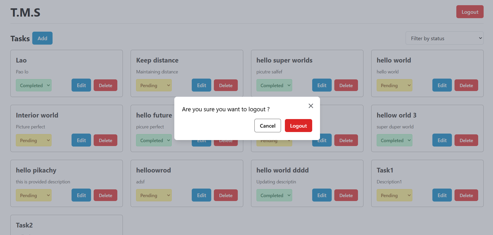

# Task-management-system

###### Setup: Clone repository

###### Client App
1. Go into client folder
2. Do npm i
3. npm start

###### Server App
1. Go into server folder
2. Do npm i
3. Add Env
```
    NODE_ENV=development
    PORT=9000
    CONNECTION_STRING=
    JWT_SECRET=
```
4. Do npm start

### Login Page


### Register Page


### Dashboard Page


### Add Task


### Update Task


### Logout
